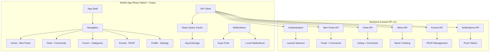

# Tea App - System Overview

## High-Level Architecture

## Core Components

### 1. Navigation Structure
- **Bottom Tabs**: Home, Feed, Forum, Events
- **Floating Action**: Quick post creation
- **Top Bar**: Profile, Chat, Notifications, Search

### 2. Data Flow
- **API Layer**: Axios + React Query for caching
- **State Management**: React Query + Context
- **Persistence**: AsyncStorage for offline cache
- **Real-time**: Expo Push Notifications

### 3. Key Features Integration
- **Men Posts**: Blur protection, flag system, comments
- **Feed**: Reddit-style voting, sorting algorithms
- **Alerts**: Name tracking with push notifications
- **Events**: RSVP with local reminders
- **Search**: Contextual filtering per section

## Technical Stack

### Frontend
- React Native + Expo SDK 51
- TypeScript for type safety
- NativeWind (Tailwind CSS for RN)
- React Native Paper components
- React Query for data fetching
- React Navigation for routing

### Backend Integration
- Laravel REST API v1
- Token-based auth (Laravel Sanctum)
- Standardized JSON responses
- Push notification integration

### Development Tools
- Expo Go for development
- EAS Build for production
- Jest for unit testing
- React Native Testing Library

## Scalability Considerations
- **Caching Strategy**: React Query with AsyncStorage persistence
- **Offline Support**: Cache-first approach with sync on reconnect
- **Performance**: Lazy loading, image optimization, 60fps target
- **Internationalization**: RTL support, Arabic/English switching

## Security & Privacy
- **Image Protection**: Auto-blur, EXIF stripping, watermarks
- **Content Moderation**: Report system, admin controls
- **Data Privacy**: Secure storage, encrypted communications
- **User Safety**: Alert system, content warnings

